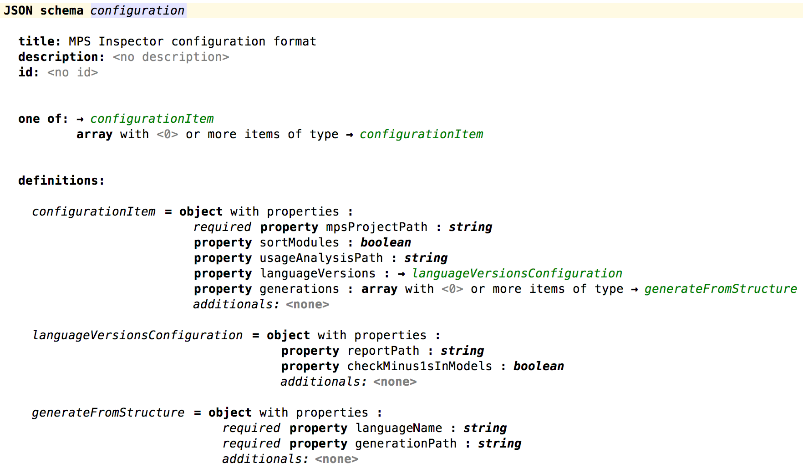

# README

The MPS Inspector is a tool meant for use in conjunction with [JetBrains' MPS](https://www.jetbrains.com/mps/).
It works on an MPS project, and can perform various maintenance functions on MPS XML files - such files have extension `.mpl`, `.msd`, or `.mps`.
(It relies heavily on the assumption that the standard persistence strategy is used.)


## Using the tool

The tool takes the form of a Java JAR file that can be downloaded from the releases section, and can be run from the commandline as follows:

```
java -jar mps-inspector-0.1.2.jar <path_to_configuration.json>
```

(Obviously, this presumes that Java is installed.
 Considering you're using MPS, I'd say that is not too wild.)

It takes a JSON file as input.
The schema for the JSON file can be found [here](docs/configuration.json).
A nicer representation of this can be obtained by opening [this MPS project](../mps-open-source) in MPS and looking at [this model](http://127.0.0.1:63320/node?ref=r%3Af1a3e78d-0501-4cd7-bd93-048bebea3b89%28JsonSchema.MPSInspector%29%2F3866676681422830897).
For convenience, here's a screenshot of that model, which uses my JSON Schema language:


An example can be found [here](./src/test/resources/tryOnOwn.json).
The format is an array of configuration items, which are objects with the following names, types, and meanings:

* `mpsProjectPath`: a string with the path (relative to the cwd) to the root of the MPS project to inspect.
* `sortModules`: `true`/`false`, determines whether to sort the entries in the file `.mps/modules.xml`.
    This has no effect on (the loading of) the MPS project itself, but makes it easier to manually compare revisions of this file.
* `usageAnalysisPath`: a string with the path (relative to the cwd) to which a report of a usage analysis (see [below](#usage-analysis)) is written.
* `languageVersions`: an object that triggers some language version analyses.
* `languageVersions.reportPath`: a string with the path (relative to the cwd) to which an overview of all languages in this project (again: regardless whether they'd actually be loaded by MPS as part of the project!) including their version number, is written as a `,`-separated file.
* `languageVersions.checkMinus1sInModels`: `true`/`false`, triggers checking all models for occurrences of -1 for the version of languages depended on.
    MPS sometimes looses track of correct language versions, and such, while merging/rebasing.
    The root cause for this should be addressed by [this ticket registered with JetBrains](https://youtrack.jetbrains.com/issue/MPS-29937).
* `generations`: an array of generation items - this is still a very experimental feature, hence goes undocumented for now.


### Usage analysis

The usage analysis scans all MPS model XML files (regardless whether they'd actually be loaded by MPS as part of the project!), and tallies concept's instances as well as populated features (=properties, children, references).
The report is a `,`-separated file, where the 1st column contains the fully-qualified name of a concept or a feature, and the 2nd column is the number of instances encountered over the whole project.
The fully-qualified name of a feature is of the following form: `<fully-qualified name of the owning concept>#<name of the feature"`.


## Raison d'être

The reason for this tool's existence is wanting to have some way to in(tro)spect MPS projects outside of MPS itself.
Instead of trying to shoehorn such functionality into an MPS plugin, the idea is to run a separate process that inspects, and potentially auto-fixes MPS XML files.
Also, running MPS headless is typically somewhat problematic to set up, and get/keep working.
As this tool proves, it's not always necessary to actually load and run MPS.

(It also serves as a small project for me to learn Kotlin "on the job".
The required code is not very complicated, but is helped by Kotlin's language features.)

