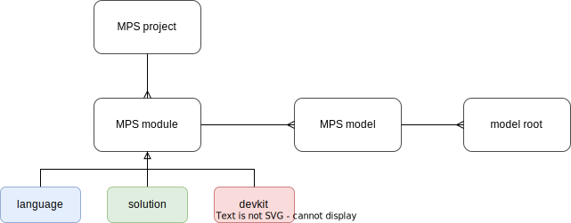
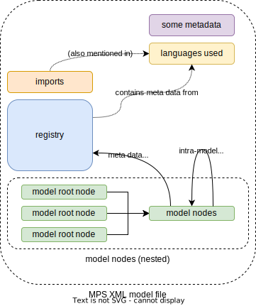
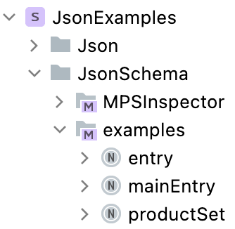
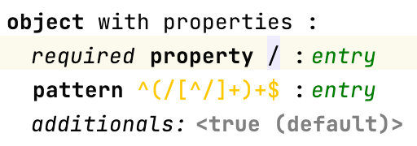
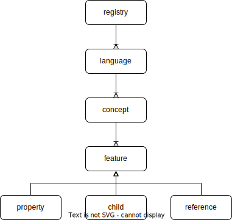

= Format of MPS' model XML files

By default, MPS stores it models as XML files with extension `.mps`.
These XML files have a proprietary format that's relatively easy to understand after some reverse engineering.
In particular, you don't *need* MPS to consume -or to some extent (if you're feeling adventurous): even change- such files.
This may come in handy at various times.
E.g., I have fixed model files that MPS refused to load by directly editing the XML.
In one case, a language migration had failed in an exotic way, leading to invalid indices (see below for an explanation of what these are) being used.

I'll explain some aspects of the proprietary MPS XML file format here.
As example material, I'll use models residing in link:../../mps-open-source/[the MPS project] in this repository.
In particular, I'll use the structure models from the Json and JsonSchema languages, and models that use the JsonSchema language.

== File-level organization of an MPS project

.A hierarchical (ERD-like) diagram of the organization of high-level structural concepts in MPS.

An MPS _project_ essentially is a collection of MPS modules.
Three kinds of MPS _modules_ exist:

[horizontal]
**devkit**:: Not important for us, so I'll ignore that kind from now on.
**language**:: A module which implements an MPS language, and corresponds to a directory `<project root>/languages/<language name>/`.
**solution**:: Any other module, and corresponds to a directory `<project root>/solutions/<solution name>/`.

You can recognize this file hierarchy also somewhat in the project's Logical View, modulo the use of _virtual folders_.

The directory of a module (of kind language or solution) generally has the following structure:

[horizontal]

`classes_gen/`:: Contains Java class that are compiled from generated sources.

`generator/`:: Contains everything related to the generators in a language module.
(This directory is not present in other kinds of modules.)
It's actually a "`mini MPS module`" in the sense that its nested directory structure is somewhat similar to a solution module.
It has `classes_gen/`, `source_gen/`, `source_gen.caches/` directories.
It also has a `template/` directory which contains the generators in XML files named `<generator name>@generator.mps` - the default generator name is "`default`".
I'll ignore MPS generators from now on.

metadata file:: An XML file that declares metadata for the module, such as dependencies.
Its file name is either `<language name>.mpl` or `<solution name>.msd`.
We don't look at these files.

`models/`:: contains the actual models in this module, in the form of files in the proprietary MPS XML file format named `<model name>.mps`.
For a language module these typically are: `behavior.mps`, `constraints.mps`, `editor.mps`, `intentions.mps`, `structure.mps`, `typesystem.mps` - these correspond to the standard aspects of the language in an obvious way.

`source_gen/`:: contains sources (such as `.java` files) generated by the generator(s) of the language that this module depends on.

`source_gen.caches/`:: metadata about which files in `source_gen/` are generated from some version of the models (identified through a hash)
This is used to determine whether generated sources are out-of-sync with models they're generated from.

The models you're normally interested in are models inside solution modules, so files `<project root/solutions/<solution name>/models/*.mps`.

== Structure of model files

.A high-level hierarchical (ERD-like) diagram of the organization of an MPS XML model file.

Let's have a look at a summarized example of the MPS XML model file `JsonSchema.examples.mps` found link:../../mps-open-source/solutions/JsonExamples/models/JsonSchema.examples.mps[here]:

.A summarized version of the MPS XML model file `JsonSchema.examples.mps`.
[source,xml]
----
<?xml version="1.0" encoding="UTF-8"?>
<model ref="r:b4b5771b-5079-43c8-a264-54aab75bad8b(JsonSchema.examples)"> <1>
  <persistence version="9" />
  <languages>
    <use id="332c9129-fd88-4f4c-a448-1f9b461e11cb" name="JsonSchema" version="0" /> <2>
  </languages>
  <imports>   <3>
    ...
  </imports>
  <registry>    <4>
    <language id="332c9129-fd88-4f4c-a448-1f9b461e11cb" name="JsonSchema">
      ...
    </language>
    ....
  </registry>
  <node concept="2n4O$4" id="2hQb6UNpvOE">  <5>
    <property role="TrG5h" value="entry" />
    <property role="2n4XgD" value="schema for an fstab entry" />
    <property role="2n4ZbQ" value="http://some.site.somewhere/entry-schema#" />
    <node concept="2n4Xgi" id="2hQb6UNpvOF" role="2n4XjE">
      ...
  </node>
  <node concept="2n4O$4" id="2hQb6UNz6C3">
    <property role="TrG5h" value="mainEntry" />
    ...
  </node>
  <node concept="2n4O$4" id="6$03NoGlHrB">
    <property role="TrG5h" value="productSet" />
    ...
  </node>
</model>
----
<1> The `ref` attribute has the following format: `r:<model ID>(<model name>)`.
The model name can contain periods (`.`), which is shown in the Logical View.
This information could be used to identify models which are imported from other models.
<2> A reference by ID + name + version to languages' used.
The ID + name bits are duplicated below, so we can forget about the `languages/use` elements, unless we need to consider version numbers.
<3> Imports of other models having the following form: `<import index="tpck" ref="r:<model ID>(<model name>)" implicit="true" />`.
The value of the `index` attribute will be used in serialized cross-model references.
<4> The so-called _registry_ contains essentially all metadata relevant for this model - more on this below.
<5> After this follow an arbitrary number of model nodes.
One node corresponds to exactly one instance of a _concept_ defined in an MPS language.
The top-level nodes are this model's roots.
I'll explain more about the structure of nodes directly below.

.A screenshot of the Logical View of the JsonExamples solution opened in MPS.

=== Structure of a node

Each `node` in the model file is the serialization of exactly one instance of a concept.
Its structure as XML is generic/fixed: you can write down an XML Schema for it.
This makes it simple to process, but one has to make some effort to understand it in terms of the language(s) used.

Let's have a look at one particular example `node` element.

.Screenshot of a part of the projection of the `entry` model root in the JsonSchema language. The highlighted object corresponds to the XML fragment below.

.The complete XML `node` element corresponding to one node in the `JsonSchema.examples.mps` model file (reformatted slightly for clarity).
[source,xml]
----
<node
    concept="2n4Xgh"    <1>
    id="2hQb6UNz6C5"    <2>
    role="2n4XjC"       <3>
>
  <property role="TrG5h" value="/" />   <4>
  <property role="2n4XjG" value="true" />
  <node concept="2nZjnx" id="2hQb6UNziLJ" role="2ns3$z">    <5>
    <ref role="2nZjnW" node="2hQb6UNpvOE" resolve="entry" />    <6>
  </node>
</node>
----
<1> The `concept` attribute holds an _index_ of a concept of an MPS language, which is a string typically 6 characters long.
This `node` element is (the serialization of) an instance of that concept.
This index can be looked up in the registry - see below for more explanation about that.
<2> The `id` attribute holds the ID (which is unique for this model file, not necessarily across all model files) of this instance.
<3> The `role` attribute holds the index of the property of the concept of the node that contains this node.
For model roots, the `role` attribute is empty (so `undefined`).
<4> A ``node``'s `property` sub element holds the value of properties of a concept.
Its `role` attribute holds the index of the property.
The `value` attribute holds the (string-serialized) value.
<5> Nested `node` elements correspond to child nodes, which are contained through a child _feature_.
<6> A ``node``'s `ref` sub element holds a reference to another `node` that's not contained directly - see the separate paragraph about this directly below.

A concept has three kinds of features:

[horizontal]
property:: Holds a simple value, such as a `boolean`, a `string` (which may be constrained through a `ConstrainedDataType`), or an `integer`.
child:: Holds any (constrained through the child feature's cardinality, which can be: 0..1, 1, 0..n, or 1..n) number of child nodes having as type the concept (which can have sub types/concepts) specified for the child feature.
reference:: Holds zero or one references to any node having as type the concept (which can have sub types/concepts) specified for the reference feature.

==== References

A `ref` element has no content, and the following attributes:

[horizontal]
`role`:: Holds the ID/indices of the concept's reference feature.
`node`:: When present, contains the ID of the targeted `node`.
`to`:: References a `node` outside the current model file, through the format `<import index>:<node ID>`.
The `<import index>` must be resolved through the imports declared near the top of the file - as described above.
The `to` and `node` attributes are mutually exclusive.
`resolve`:: Contains the name of the targeted `node` - assuming it has one.
In principle, this name is a duplicate of the name of the `node` targeted by the reference.
This is useful when a reference couldn't be resolved for some reason.
The (now-not-so-duplicate-anymore) name in `resolve` can be used to:
* Find the unresolved reference's target, typically using implemented custom scoping, or just the concept that's declared as the type of the reference feature.
* Propose to the user to create a new instance with that name, of some concept that would "`fit`".

=== Structure and purpose of the registry

An MPS XML model file's registry contains all the metadata necessary to know (about) for this model.
The registry is the link between ``node``s and the structures (or: _metamodels_) of languages used in the model.
In particular: the indices held by the `concept` and `role` attributes of a `node`, and of `property`, `node`, and `ref` elements nested by those, link to the registry.

.The part of the registry of the `JsonSchema.examples.mps` model file that's relevant to the example node above. (The values of all `id` attributes have been abbreviated to "`...`".)
[source,xml]
----
<registry>
  <language id="..." name="JsonSchema">
    ...
    <concept id="..." name="JsonSchema.structure.JsonRegularProperty" flags="ng" index="2n4Xgh">
      <property id="..." name="required" index="2n4XjG" />
      <property id="..." name="description" index="15mDuz" />
    </concept>
    ...
    <concept id="..." name="JsonSchema.structure.JsonObjectDef" flags="ng" index="2n4Xgi">
      <property id="..." name="title" index="15meCP" />
      <child id="..." name="properties" index="2n4XjC" />
    </concept>
    ...
    <concept id="..." name="JsonSchema.structure.JsonProperty" flags="ng" index="2ns3$A">
      <child id="..." name="type" index="2ns3$z" />
    </concept>
    <concept id="..." name="JsonSchema.structure.JsonReferableRef" flags="ng" index="2nZjnx">
      <reference id="..." name="ref" index="2nZjnW" />
    </concept>
    ...
  </language>
  <language id="..." name="jetbrains.mps.lang.core">
    <concept id="..." name="jetbrains.mps.lang.core.structure.INamedConcept" flags="ng" index="TrEIO">
      <property id="..." name="name" index="TrG5h" />
    </concept>
  </language>
</registry>
----

The registry contains `language` elements, which contain `concept` elements, which contain feature elements `property`, `child`, or `reference`.
All of these elements have `name` and `id` attributes, and all but `language` elements have an `index` attribute.
Instances of concepts refer by index to these `concept` elements through their `concept` attributes.
Likewise, features' values refer by index to their corresponding feature elements in the index.

.A high-level (ERD-like) hierarchical diagram of the elements in the registry of an MPS XML model file.

[NOTE]
====
I have currently no idea what the `flags` attribute means.
It seems to always have a 2-character value with the 1st one being `i` or `n`, and the 2nd `g` or `n`.
Models in solution modules seem to only have `flags="ng"`.
====

The registry doesn't know anything about a feature's type and cardinality.
(As far as I can see, this information is not hidden in the value of the `flags` attribute.)

Neither does the registry know about inheritance.
Consequentially, a feature might be found under "`any`" concept in the registry.

As an example: every concept that extends from the concept "`INamedConcept`" from the JetBrains MPS Core language has a "`name`" property.
Both that "`INamedConcept`" concept and its "`name`" property is in the registry.
The "`JsonRegularProperty`" concept extends (_via-via_) from "`INamedConcept`" but doesn't mention the "`name`" property explicitly among its features.

Let's understand the example `node` element above by looking at the registry.

[source,xml]
----
<node
    concept="2n4Xgh"    <1>
    id="2hQb6UNz6C5"
    role="2n4XjC"       <2>
>
  <property role="TrG5h" value="/" />       <3>
  <property role="2n4XjG" value="true" />   <4>
  <node concept="2nZjnx" id="2hQb6UNziLJ" role="2ns3$z">    <5>
    <ref
      role="2nZjnW"    <6>
      node="2hQb6UNpvOE" resolve="entry" />
  </node>
</node>
----
<1> The concept index "2n4Xgh" corresponds to the concept with fully-qualified name "`JsonSchema.structure.JsonRegularProperty`", which encodes a regular (i.e., non-pattern) property of an object definition.
(From now on, I'll drop the "`JsonSchema.structure`" prefix off of a concept's name.)
<2> The role index "2n4XjC" corresponds to the child feature named "`properties`" of the concept "`JsonObjectDef`".
<3> The role index "TrG5h" corresponds to the property feature named "`name`" of the concept "`INamedConcept`" (of the MPS Core language).
Note that this particular role index occurs a lot in MPS XML model files, so it seems to be pretty stable.
It's also easily recognisable because it's only 5 characters long, while normal indices are 6 characters long.
<4> The role index "2n4XjG" corresponds to the "`required`" property of "`JsonRegularProperty`".
<5> The role index "2ns3$z" corresponds to the "`type`" child feature of the "`JsonProperty`" concept from which "`JsonRegularProperty`" extends.
  The concept index "2nZjnx" corresponds to "`JsonReferableRef`".
<6> The role index "2nZjnW" corresponds to the "`ref`" reference feature of "`JsonReferableRef`".

Let's translate the example node in XML format to (some sort of) JavaScript (JS) format.
(Because of resolved references, this JavaScript format usually can't be represented/serialized as JSON.)
Instances of concepts (serialized as `node` XML elements) are translated 1-to-1 to JS objects.
(Incidentally, this interpretation is exactly what happens when using the deserializer in this repository.)

[source,javascript,subs=+quotes]
----
{
  $metatype: "JsonObjectDef", <1>
  // ...  <2>
  properties: [ <3>
    {
      $metatype: "JsonRegularProperty",
      name: "/",
      required: "true", <4>
      type: [
        {
          $metatype: "JsonReferableRef",
          ref: [
            {
              $ref: { <5>
                target: <(might not resolve) object reference to a deserialized JS after references have been resolved>,
                targetId: <node ID of node targeted by the reference>,
                targetName: <value of "`name`" property of targeted node>,
                targetModel: <(optional) index of other model that the targeted node resides in>
            }
          ]
        }
    }
  ]
}
----
<1> We know that our example node must be contained by an instance of the "`JsonObjectDef`" concept.
So, we create a corresponding JS object with a key-value pair indicating the concept of the instance.
(The choice "`$metatype`" for the key matches the deserialization in this repository.)
<2> That instance may have more settings than those corresponding to our example node, but we can't determine those from the XML of the example node.
<3> The example node is contained through the "`properties`" child feature.
The registry doesn't know about cardinality, so we can't know whether "`properties`"' value should be an array or not.
We know that it should be an array from both the screenshot (which shows more than one property on the object definition), and the plural name, but generically that knowledge is unavailable/-usable that at this point.
In general, we can simply assume all child features to be multi-valued.
It's up to processors of this JS value to "`do the right thing`": either `map`-ing over all items in the array, or just taking the first item while interpreting the empty array as "`empty`"/`undefined`.
<4> The "`required`" property has type `boolean`, but we can't know that from the registry.
Without looking at the `structure` model of the JsonSchema language itself, we have little choice but to deserialize as the string `"true"` rather than the boolean `true`.
<5> For various reasons which are better explained elsewhere, it's useful to deserialize references by a node's ID in the XML to a distinct JS object.

==== Limitations of the registry

A registry in any particular model file doesn't contain the complete metamodel(s) of the language(s) used:

* It contains metadata only those concepts which are instantiated in the model file.
* Of those concepts, it only contains the features (properties, children, references) for which at least one instance has a non-`null`/`undefined`/default value.
* For those features, it doesn't declare all metadata, but just enough metadata to link to the actual structure/metamodel of the language used.
In particular, a feature's type and its cardinality is not declared in the registry.
* It isn't aware of a default value of a property.
This is especially cumbersome for enum-valued properties.
The processor of deserialized JS values must take care to distinguish between the presence of a default value (with the property having a non-optional value), and the lack of a value (with the property having an optional value).
In either case, the serialization doesn't (have to) mention any value at all.
* It isn't aware of inheritance in any way.
* It isn't aware of whether a concept is concrete, abstract, or an interface concept.

The lack of type information on features is not relevant for (de-)serialization because what concept a node is an instance of, is apparent from its metadata.
The lack of cardinality information is slightly more problematic, but can be worked around by assuming all child and references features are multi-valued.
(Property features are never multi-valued, but can have cardinality 0..1 which a processor of the JS value should take into account.)
Property values are always serialized as JS strings.
When type and cardinality information is required one must inspect the `structure` model of the language used.
This is the case e.g.:

* To parse properties' values into their proper types, e.g. numbers.
* To generate proper (or at least: helpful) type definitions in TypeScript/Java/etc..

